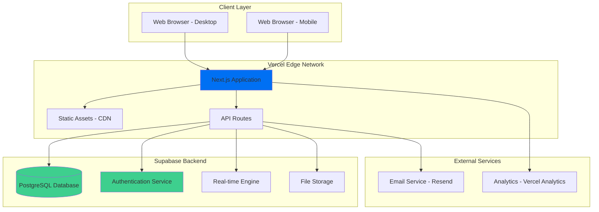
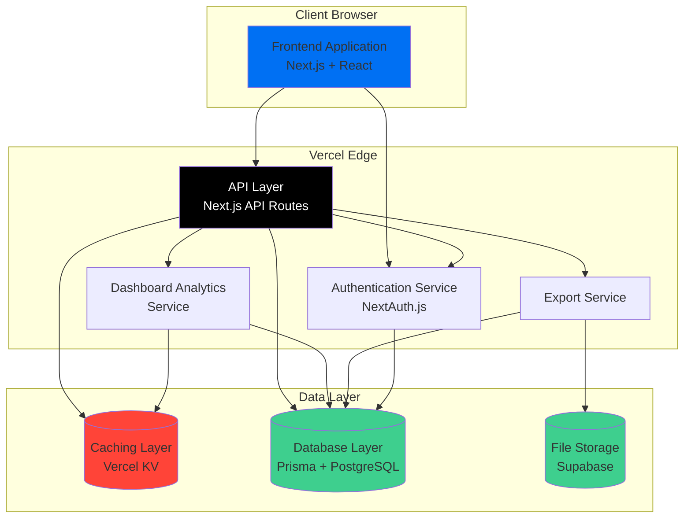
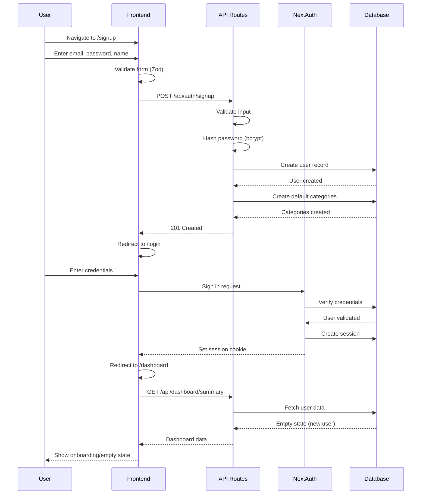
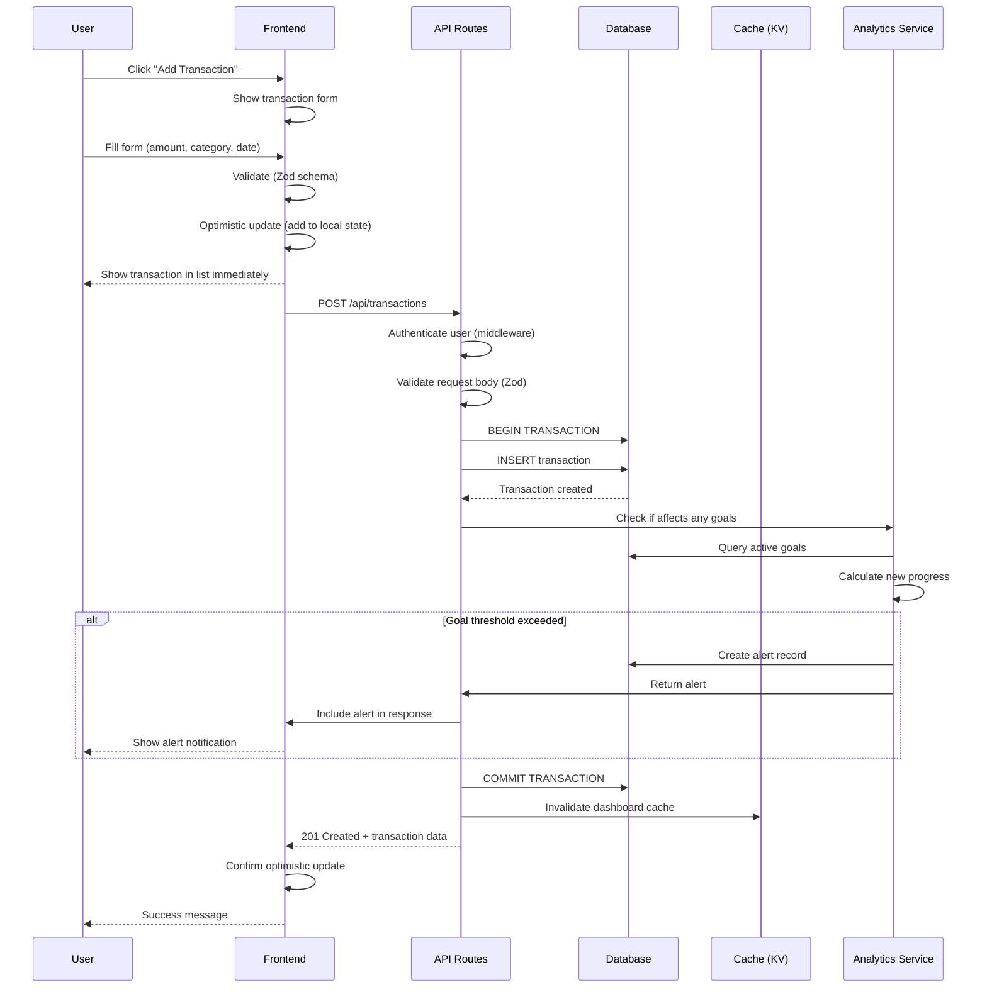
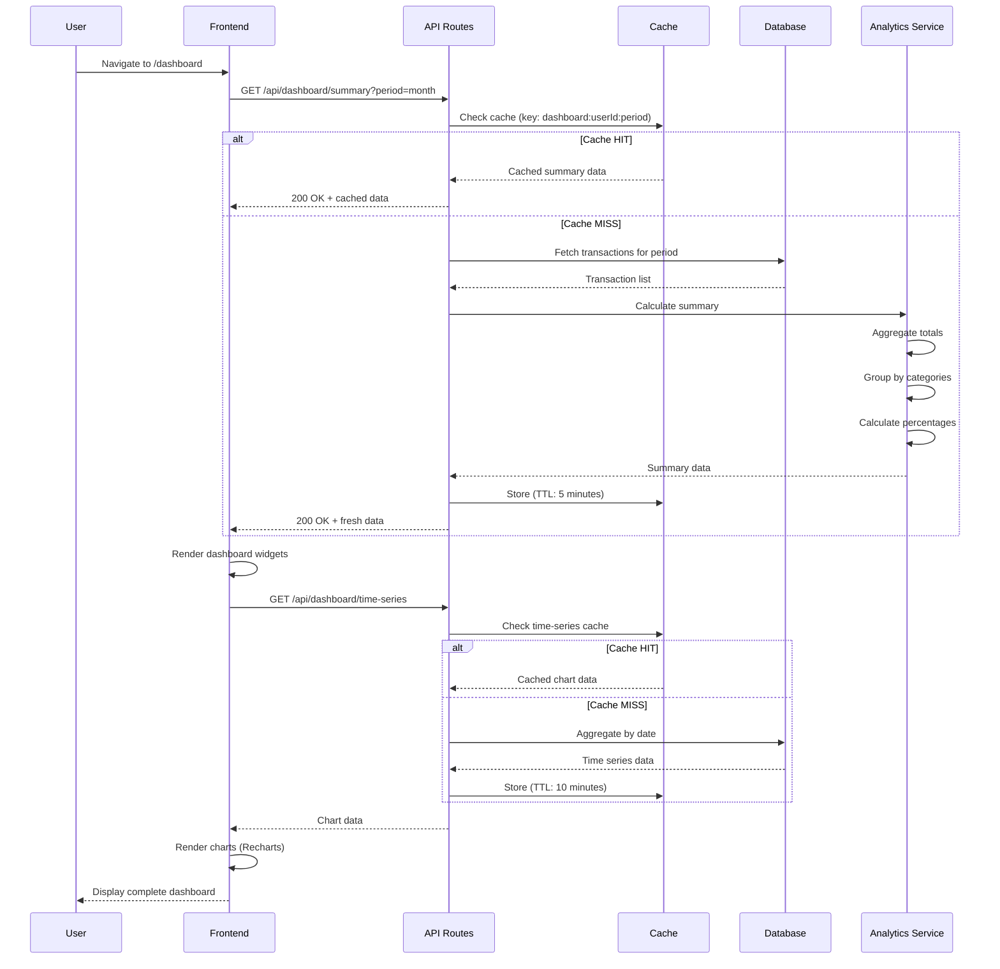

# Dashboard de Finanças Pessoais - Fullstack Architecture Document

## 1. Introduction

This document outlines the complete fullstack architecture for **Dashboard de Finanças Pessoais**, including backend systems, frontend implementation, and their integration. It serves as the single source of truth for AI-driven development, ensuring consistency across the entire technology stack.

This unified approach combines what would traditionally be separate backend and frontend architecture documents, streamlining the development process for modern fullstack applications where these concerns are increasingly intertwined.

### 1.1 Starter Template or Existing Project

**N/A - Greenfield project**

However, the **T3 Stack** (Next.js + tRPC + Tailwind + TypeScript + Prisma) is recommended as a starter, which aligns perfectly with the PRD's suggested tech stack and provides:

- End-to-end type safety
- Integrated authentication with NextAuth.js
- Built-in database ORM with Prisma
- Rapid development velocity
- Best practices configured out-of-the-box

### 1.2 Change Log

| Date       | Version | Description                   | Author                 |
| ---------- | ------- | ----------------------------- | ---------------------- |
| 2025-10-29 | 1.0     | Initial architecture document | Winston (Architect AI) |

---

## 2. High Level Architecture

### 2.1 Technical Summary

The Dashboard de Finanças Pessoais will be built as a **modern Jamstack application** using Next.js 14+ with server-side rendering and API routes, deployed on **Vercel** for optimal performance. The frontend leverages React with TypeScript and Tailwind CSS for type-safe, responsive UI development, while the backend uses Next.js API routes with Prisma ORM connecting to **PostgreSQL** for data persistence. Authentication is handled through **NextAuth.js** with secure session management, and the architecture supports progressive enhancement from MVP to advanced features including real-time updates via WebSockets and export functionality. This serverless-first approach ensures automatic scaling, reduces operational overhead, and achieves the PRD's sub-3-second load time requirement through edge caching and optimized data fetching strategies.

### 2.2 Platform and Infrastructure Choice

**Selected Platform:** Vercel + Supabase

**Rationale:** Fastest time-to-market, Next.js native deployment, built-in auth & PostgreSQL, excellent DX, generous free tier. Aligns with PRD's Next.js requirement and enables rapid MVP development.

**Key Services:**

- **Vercel:** Hosting, CDN, Serverless Functions, Edge Network
- **Supabase:** PostgreSQL Database, Authentication, Real-time subscriptions, Storage (for future CSV/PDF exports)

**Deployment Host and Regions:**

- **Primary:** Vercel Edge Network (Global CDN)
- **Database:** Supabase South America region (closest to Brazil) or US East

### 2.3 Repository Structure

**Structure:** Monorepo (Single repository approach)  
**Monorepo Tool:** Native Next.js structure (no additional tooling needed for this scale)  
**Package Organization:**

```
dash-bmad/
├── src/
│   ├── app/              # Next.js 14 App Router
│   ├── components/       # React components
│   ├── lib/              # Shared utilities
│   ├── types/            # TypeScript types
│   └── server/           # Server-side logic
├── prisma/               # Database schema
├── public/               # Static assets
└── tests/                # Test files
```

### 2.4 High Level Architecture Diagram



### 2.5 Architectural Patterns

- **Jamstack Architecture:** Static generation with serverless API routes - _Rationale:_ Optimal performance, security, and scalability for the dashboard while maintaining dynamic data capabilities

- **Component-Based UI:** Reusable React components with TypeScript - _Rationale:_ Maintainability, type safety, and rapid UI development with consistent design system

- **Server Components Pattern:** Next.js 14 Server Components for data fetching - _Rationale:_ Reduces client-side JavaScript, improves initial load performance, and enables secure server-side operations

- **Repository Pattern:** Prisma ORM as data access layer - _Rationale:_ Clean separation of database logic, type-safe queries, and easy migrations

- **API Gateway Pattern:** Next.js API routes as single entry point - _Rationale:_ Centralized authentication, request validation, and consistent error handling

- **Optimistic UI Updates:** Client-side state updates before server confirmation - _Rationale:_ Improves perceived performance for financial transactions, critical for user experience

- **Server Actions:** Next.js Server Actions for mutations - _Rationale:_ Simplified data mutations without explicit API routes, built-in revalidation

---

## 3. Tech Stack

### Technology Stack Table

| Category                 | Technology            | Version  | Purpose                           | Rationale                                                                                               |
| ------------------------ | --------------------- | -------- | --------------------------------- | ------------------------------------------------------------------------------------------------------- |
| **Frontend Language**    | TypeScript            | 5.3+     | Type-safe JavaScript for frontend | Catches errors at compile time, especially critical for financial calculations; excellent IDE support   |
| **Frontend Framework**   | Next.js               | 14.1+    | React framework with SSR/SSG      | Best-in-class DX, built-in routing, API routes, Image optimization, perfect Vercel integration          |
| **UI Component Library** | shadcn/ui             | Latest   | Accessible React components       | Copy-paste components (no npm bloat), built on Radix UI primitives, full customization, Tailwind-native |
| **State Management**     | Zustand               | 4.4+     | Lightweight global state          | Simpler than Redux, perfect for auth state and user preferences, minimal boilerplate                    |
| **CSS Framework**        | Tailwind CSS          | 3.4+     | Utility-first CSS                 | Rapid UI development, consistent design system, tiny production bundle, responsive design made easy     |
| **Backend Language**     | TypeScript            | 5.3+     | Type-safe server-side code        | Shared types between frontend/backend, reduces integration bugs                                         |
| **Backend Framework**    | Next.js API Routes    | 14.1+    | Serverless API endpoints          | Collocated with frontend, automatic deployment, built-in middleware support                             |
| **API Style**            | REST                  | N/A      | HTTP-based API                    | Simple, well-understood, sufficient for CRUD operations; can add tRPC later if needed                   |
| **Database**             | PostgreSQL            | 15+      | Relational database               | ACID compliance critical for financial data, excellent Prisma support, JSON support for flexibility     |
| **ORM**                  | Prisma                | 5.8+     | Type-safe database client         | Auto-generated types, intuitive queries, excellent migrations, TypeScript-first                         |
| **Cache**                | Vercel KV (Redis)     | Latest   | Edge caching layer                | Fast session storage, rate limiting, dashboard metrics caching                                          |
| **File Storage**         | Supabase Storage      | Latest   | CSV/PDF export storage            | S3-compatible, integrated with auth, CDN delivery                                                       |
| **Authentication**       | NextAuth.js           | 5.0+     | Authentication solution           | Supports email/password + OAuth, session management, database sessions via Prisma adapter               |
| **Frontend Testing**     | Vitest                | 1.2+     | Unit testing framework            | Fast, Vite-powered, Jest-compatible API, better DX than Jest                                            |
| **Component Testing**    | React Testing Library | 14+      | Component testing                 | Best practices for testing user behavior, not implementation                                            |
| **Backend Testing**      | Vitest                | 1.2+     | API/unit testing                  | Unified testing framework for frontend and backend                                                      |
| **E2E Testing**          | Playwright            | 1.41+    | End-to-end testing                | Reliable, fast, multi-browser, great debugging tools                                                    |
| **Build Tool**           | Turbopack             | Built-in | Next.js build system              | Faster than Webpack, zero config, optimized for Next.js                                                 |
| **Package Manager**      | pnpm                  | 8.15+    | Fast package manager              | Faster installs, disk space efficient, strict dependency resolution                                     |
| **Linting**              | ESLint                | 8.56+    | Code quality/standards            | Catches common errors, enforces code style                                                              |
| **Formatting**           | Prettier              | 3.2+     | Code formatting                   | Consistent code style across team                                                                       |
| **Type Checking**        | TypeScript Compiler   | 5.3+     | Static type checking              | Catches type errors before runtime                                                                      |
| **Schema Validation**    | Zod                   | 3.22+    | Runtime validation                | Type-safe API validation, shared schemas between client/server                                          |
| **Date Handling**        | date-fns              | 3.3+     | Date manipulation                 | Lightweight, tree-shakeable, good for financial date calculations                                       |
| **Charts**               | Recharts              | 2.10+    | Data visualization                | React-native charts, responsive, customizable, good documentation                                       |
| **Forms**                | React Hook Form       | 7.50+    | Form management                   | Performant, minimal re-renders, great validation integration with Zod                                   |
| **CI/CD**                | Vercel                | N/A      | Continuous deployment             | Automatic deployments on git push, preview environments, zero config                                    |
| **Monitoring**           | Vercel Analytics      | N/A      | Performance monitoring            | Real Vitals tracking, zero config, privacy-friendly                                                     |
| **Error Tracking**       | Sentry                | Latest   | Error monitoring                  | Production error tracking, performance monitoring, user feedback                                        |
| **Logging**              | Axiom                 | Latest   | Structured logging                | Serverless-friendly, fast queries, generous free tier                                                   |

---

## 4. Data Models

### 4.1 User

**Purpose:** Represents an authenticated user of the financial dashboard with their profile information and settings.

**Key Attributes:**

- `id`: string (UUID) - Unique identifier
- `email`: string - User's email for authentication
- `name`: string - User's display name
- `createdAt`: Date - Account creation timestamp
- `updatedAt`: Date - Last profile update

**TypeScript Interface:**

```typescript
export interface User {
  id: string;
  email: string;
  name: string;
  passwordHash: string; // Never exposed to frontend
  createdAt: Date;
  updatedAt: Date;
}

export interface UserProfile {
  id: string;
  email: string;
  name: string;
  createdAt: Date;
}
```

**Relationships:**

- One User has many Transactions
- One User has many Categories
- One User has many Goals

---

### 4.2 Transaction

**Purpose:** Represents a financial transaction (either income or expense) with categorization and metadata.

**Key Attributes:**

- `id`: string (UUID) - Unique identifier
- `userId`: string - Owner of the transaction
- `type`: 'INCOME' | 'EXPENSE' - Transaction type
- `amount`: Decimal - Monetary value (stored as integer cents to avoid floating point issues)
- `description`: string - Transaction description
- `categoryId`: string - Associated category
- `date`: Date - Transaction date
- `createdAt`: Date - Record creation timestamp

**TypeScript Interface:**

```typescript
export type TransactionType = "INCOME" | "EXPENSE";

export interface Transaction {
  id: string;
  userId: string;
  type: TransactionType;
  amount: number; // Stored in cents (e.g., $10.50 = 1050)
  description: string;
  categoryId: string;
  date: Date;
  createdAt: Date;
  updatedAt: Date;

  // Relations (populated when needed)
  category?: Category;
  user?: User;
}

export interface CreateTransactionInput {
  type: TransactionType;
  amount: number;
  description: string;
  categoryId: string;
  date: Date;
}
```

**Relationships:**

- Many Transactions belong to one User
- Many Transactions belong to one Category

---

### 4.3 Category

**Purpose:** Organizes transactions into meaningful groups (e.g., "Food", "Transport", "Salary").

**Key Attributes:**

- `id`: string (UUID) - Unique identifier
- `userId`: string - Owner (allows custom categories per user)
- `name`: string - Category name
- `type`: 'INCOME' | 'EXPENSE' - Category type
- `color`: string - Hex color for UI visualization
- `icon`: string - Icon identifier
- `isDefault`: boolean - System-provided category flag

**TypeScript Interface:**

```typescript
export interface Category {
  id: string;
  userId: string | null; // null for system default categories
  name: string;
  type: TransactionType;
  color: string; // Hex color: #FF5733
  icon: string; // Icon name/identifier
  isDefault: boolean;
  createdAt: Date;
  updatedAt: Date;

  // Relations
  transactions?: Transaction[];
}

export interface CreateCategoryInput {
  name: string;
  type: TransactionType;
  color: string;
  icon: string;
}
```

**Relationships:**

- Many Categories belong to one User (or null for defaults)
- One Category has many Transactions

---

### 4.4 Goal

**Purpose:** Represents financial goals with spending limits and alerts.

**Key Attributes:**

- `id`: string (UUID) - Unique identifier
- `userId`: string - Owner of the goal
- `name`: string - Goal name
- `targetAmount`: number - Target amount in cents
- `currentAmount`: number - Current progress in cents
- `categoryId`: string | null - Optional category filter
- `startDate`: Date - Goal period start
- `endDate`: Date - Goal period end
- `alertThreshold`: number - Alert when percentage reached (0-100)

**TypeScript Interface:**

```typescript
export interface Goal {
  id: string;
  userId: string;
  name: string;
  targetAmount: number; // In cents
  currentAmount: number; // In cents, calculated from transactions
  categoryId: string | null; // Optional: limit goal to specific category
  startDate: Date;
  endDate: Date;
  alertThreshold: number; // Percentage: 80 means alert at 80%
  isActive: boolean;
  createdAt: Date;
  updatedAt: Date;

  // Relations
  category?: Category;
  user?: User;
}

export interface CreateGoalInput {
  name: string;
  targetAmount: number;
  categoryId?: string;
  startDate: Date;
  endDate: Date;
  alertThreshold: number;
}

export interface GoalProgress {
  goalId: string;
  percentageComplete: number;
  remaining: number;
  isOverBudget: boolean;
  shouldAlert: boolean;
}
```

**Relationships:**

- Many Goals belong to one User
- Many Goals optionally belong to one Category

---

### 4.5 Summary Metrics (Computed)

**Purpose:** Pre-calculated or computed dashboard metrics for performance.

**TypeScript Interface:**

```typescript
export interface DashboardSummary {
  userId: string;
  period: {
    start: Date;
    end: Date;
  };
  totalIncome: number;
  totalExpenses: number;
  balance: number;
  transactionCount: number;
  topCategories: CategorySummary[];
  goalsProgress: GoalProgress[];
}

export interface CategorySummary {
  categoryId: string;
  categoryName: string;
  categoryColor: string;
  totalAmount: number;
  transactionCount: number;
  percentage: number; // Percentage of total expenses/income
}

export interface TimeSeriesData {
  date: Date;
  income: number;
  expenses: number;
  balance: number;
}
```

---

## 5. API Specification

### REST API Specification (OpenAPI 3.0)

```yaml
openapi: 3.0.0
info:
  title: Dashboard de Finanças Pessoais API
  version: 1.0.0
  description: RESTful API for personal finance dashboard management

servers:
  - url: https://dash-bmad.vercel.app/api
    description: Production server
  - url: http://localhost:3000/api
    description: Local development server

components:
  securitySchemes:
    sessionAuth:
      type: apiKey
      in: cookie
      name: next-auth.session-token

  schemas:
    Error:
      type: object
      properties:
        error:
          type: string
        message:
          type: string
        code:
          type: string

    Transaction:
      type: object
      properties:
        id:
          type: string
          format: uuid
        userId:
          type: string
        type:
          type: string
          enum: [INCOME, EXPENSE]
        amount:
          type: integer
          description: Amount in cents
        description:
          type: string
        categoryId:
          type: string
        date:
          type: string
          format: date-time
        createdAt:
          type: string
          format: date-time
        category:
          $ref: "#/components/schemas/Category"

    Category:
      type: object
      properties:
        id:
          type: string
        name:
          type: string
        type:
          type: string
          enum: [INCOME, EXPENSE]
        color:
          type: string
          pattern: "^#[0-9A-F]{6}$"
        icon:
          type: string
        isDefault:
          type: boolean

    Goal:
      type: object
      properties:
        id:
          type: string
        name:
          type: string
        targetAmount:
          type: integer
        currentAmount:
          type: integer
        categoryId:
          type: string
          nullable: true
        startDate:
          type: string
          format: date
        endDate:
          type: string
          format: date
        alertThreshold:
          type: integer
          minimum: 0
          maximum: 100
        isActive:
          type: boolean

security:
  - sessionAuth: []

paths:
  # Authentication
  /auth/signup:
    post:
      tags: [Authentication]
      summary: Register a new user
      security: []
      requestBody:
        required: true
        content:
          application/json:
            schema:
              type: object
              required: [email, password, name]
              properties:
                email:
                  type: string
                  format: email
                password:
                  type: string
                  minLength: 8
                name:
                  type: string
      responses:
        "201":
          description: User created successfully
        "400":
          description: Invalid input or email already exists

  # Transactions
  /transactions:
    get:
      tags: [Transactions]
      summary: Get all transactions for the authenticated user
      parameters:
        - name: type
          in: query
          schema:
            type: string
            enum: [INCOME, EXPENSE]
        - name: categoryId
          in: query
          schema:
            type: string
        - name: startDate
          in: query
          schema:
            type: string
            format: date
        - name: endDate
          in: query
          schema:
            type: string
            format: date
      responses:
        "200":
          description: List of transactions

    post:
      tags: [Transactions]
      summary: Create a new transaction
      requestBody:
        required: true
        content:
          application/json:
            schema:
              type: object
              required: [type, amount, description, categoryId, date]
              properties:
                type:
                  type: string
                  enum: [INCOME, EXPENSE]
                amount:
                  type: integer
                  minimum: 1
                description:
                  type: string
                categoryId:
                  type: string
                date:
                  type: string
                  format: date-time
      responses:
        "201":
          description: Transaction created

  /transactions/{id}:
    get:
      tags: [Transactions]
      summary: Get a specific transaction
      parameters:
        - name: id
          in: path
          required: true
          schema:
            type: string
      responses:
        "200":
          description: Transaction details

    patch:
      tags: [Transactions]
      summary: Update a transaction
      parameters:
        - name: id
          in: path
          required: true
          schema:
            type: string
      responses:
        "200":
          description: Transaction updated

    delete:
      tags: [Transactions]
      summary: Delete a transaction
      parameters:
        - name: id
          in: path
          required: true
          schema:
            type: string
      responses:
        "204":
          description: Transaction deleted

  # Categories
  /categories:
    get:
      tags: [Categories]
      summary: Get all categories
      responses:
        "200":
          description: List of categories

    post:
      tags: [Categories]
      summary: Create a custom category
      responses:
        "201":
          description: Category created

  # Goals
  /goals:
    get:
      tags: [Goals]
      summary: Get all goals
      responses:
        "200":
          description: List of goals

    post:
      tags: [Goals]
      summary: Create a new financial goal
      responses:
        "201":
          description: Goal created

  # Dashboard
  /dashboard/summary:
    get:
      tags: [Dashboard]
      summary: Get dashboard summary with metrics
      parameters:
        - name: startDate
          in: query
          schema:
            type: string
            format: date
        - name: endDate
          in: query
          schema:
            type: string
            format: date
      responses:
        "200":
          description: Dashboard summary

  /dashboard/time-series:
    get:
      tags: [Dashboard]
      summary: Get time series data for charts
      parameters:
        - name: startDate
          in: query
          required: true
          schema:
            type: string
            format: date
        - name: endDate
          in: query
          required: true
          schema:
            type: string
            format: date
        - name: granularity
          in: query
          schema:
            type: string
            enum: [daily, weekly, monthly]
            default: daily
      responses:
        "200":
          description: Time series data

  # Export
  /export/transactions:
    get:
      tags: [Export]
      summary: Export transactions as CSV
      parameters:
        - name: format
          in: query
          schema:
            type: string
            enum: [csv, pdf]
            default: csv
      responses:
        "200":
          description: File download
```

---

## 6. Components

### 6.1 Frontend Application (Next.js)

**Responsibility:** Client-facing web application providing the user interface, routing, and client-side logic for the financial dashboard.

**Key Interfaces:**

- Public routes: `/`, `/login`, `/signup`
- Protected routes: `/dashboard`, `/transactions`, `/goals`, `/settings`
- Client-side API calls to backend via fetch/axios
- State management via Zustand stores

**Dependencies:**

- Authentication Service (NextAuth)
- API Routes (backend)
- Supabase (real-time subscriptions)

**Technology Stack:**

- Next.js 14 (App Router)
- React 18+ with Server Components
- Tailwind CSS + shadcn/ui
- React Hook Form + Zod validation
- Recharts for visualizations
- Zustand for global state

---

### 6.2 API Layer (Next.js API Routes)

**Responsibility:** Backend API handling business logic, validation, authentication, and database operations.

**Key Interfaces:**

- RESTful endpoints: `/api/transactions`, `/api/goals`, `/api/categories`, `/api/dashboard`
- Authentication endpoints: `/api/auth/*` (handled by NextAuth)
- Middleware chain: auth → validation → rate limiting → handler

**Dependencies:**

- Database Layer (Prisma)
- Authentication Service
- Vercel KV (caching/rate limiting)

**Technology Stack:**

- Next.js API Routes
- Zod for request/response validation
- NextAuth middleware
- Prisma Client

---

### 6.3 Database Layer (Prisma ORM)

**Responsibility:** Data access abstraction providing type-safe queries, migrations, and connection pooling to PostgreSQL.

**Key Interfaces:**

- Prisma Client API (auto-generated from schema)
- CRUD operations for all models
- Complex queries for dashboard aggregations
- Transaction support for atomic operations

**Dependencies:**

- PostgreSQL (Supabase)

**Technology Stack:**

- Prisma ORM 5.8+
- PostgreSQL 15+
- Connection pooling via Prisma Accelerate (optional)

---

### 6.4 Authentication Service (NextAuth.js)

**Responsibility:** Handles user authentication, session management, and authorization checks.

**Key Interfaces:**

- Sign in/sign up flows
- Session management (cookie-based)
- Password hashing (bcrypt)
- Optional OAuth providers (Google, GitHub)
- Protected route middleware

**Dependencies:**

- Database Layer (Prisma adapter)
- Email Service (for password reset)

**Technology Stack:**

- NextAuth.js 5.0+
- Prisma Adapter
- bcrypt for password hashing

---

### 6.5 Dashboard Analytics Service

**Responsibility:** Aggregates financial data to compute metrics and generate insights.

**Key Interfaces:**

- `calculateSummary(userId, startDate, endDate)` → DashboardSummary
- `getTimeSeriesData(userId, startDate, endDate, granularity)` → TimeSeriesData[]
- `calculateGoalProgress(goalId)` → GoalProgress
- `getCategoryBreakdown(userId, type, period)` → CategorySummary[]

**Dependencies:**

- Database Layer
- Caching Layer

**Technology Stack:**

- Server-side TypeScript functions
- Prisma aggregation queries
- date-fns for date manipulation

---

### 6.6 Caching Layer (Vercel KV)

**Responsibility:** Provides fast access to frequently requested data and rate limiting.

**Key Interfaces:**

- Session storage for NextAuth
- Dashboard metrics caching (TTL: 5 minutes)
- Rate limiting counters per user/IP
- Cache invalidation on data mutations

**Technology Stack:**

- Vercel KV (Redis)
- @vercel/kv SDK

---

### 6.7 File Storage Service (Supabase Storage)

**Responsibility:** Stores and serves exported files (CSV, PDF) with authenticated access control.

**Key Interfaces:**

- Upload export files
- Generate signed URLs for downloads
- Automatic cleanup of old exports (TTL: 24 hours)

**Technology Stack:**

- Supabase Storage (S3-compatible)
- Supabase JS Client

---

### 6.8 Export Service

**Responsibility:** Generates CSV and PDF exports of transaction data.

**Key Interfaces:**

- `exportTransactionsCSV(userId, filters)` → CSV file
- `exportTransactionsPDF(userId, filters)` → PDF file
- Streaming responses for large datasets

**Dependencies:**

- Database Layer
- File Storage Service

**Technology Stack:**

- csv-writer for CSV generation
- pdfkit or Puppeteer for PDF generation
- Node.js streams

---

### 6.9 Component Diagram



---

## 7. External APIs

### 7.1 Current Integrations (MVP)

**Email Service - Resend**

- **Purpose:** Transactional emails (welcome, password reset, goal alerts)
- **Documentation:** https://resend.com/docs
- **Base URL:** https://api.resend.com
- **Authentication:** API Key in headers (`Authorization: Bearer ${API_KEY}`)
- **Rate Limits:** 100 emails/day on free tier, 50,000/month on paid

**Key Endpoints Used:**

- `POST /emails` - Send transactional email

**Integration Notes:**

- NextAuth.js email provider configuration
- Template-based emails using React Email
- Async delivery (no blocking on API response)
- Fallback: Log to console in development

---

### 7.2 Future Integrations (Post-MVP)

**Bank API Integration (Open Finance Brasil)** - Priority: Medium (v2.0)
**Currency Exchange API** - Priority: Low (optional)
**AI Financial Insights** - Priority: Low (v3.0+)

---

## 8. Core Workflows

### 8.1 User Registration and First Login



---

### 8.2 Creating a Transaction (Happy Path)



---

### 8.3 Dashboard Load with Caching



---

## 9. Database Schema

### Prisma Schema Definition

```prisma
// prisma/schema.prisma

generator client {
  provider = "prisma-client-js"
}

datasource db {
  provider = "postgresql"
  url      = env("DATABASE_URL")
}

// ============================================
// User Model
// ============================================
model User {
  id           String   @id @default(uuid())
  email        String   @unique
  name         String
  passwordHash String   @map("password_hash")
  createdAt    DateTime @default(now()) @map("created_at")
  updatedAt    DateTime @updatedAt @map("updated_at")

  // Relations
  transactions Transaction[]
  categories   Category[]
  goals        Goal[]
  accounts     Account[]
  sessions     Session[]

  @@map("users")
}

// ============================================
// NextAuth Models
// ============================================
model Account {
  id                String  @id @default(uuid())
  userId            String  @map("user_id")
  type              String
  provider          String
  providerAccountId String  @map("provider_account_id")
  refresh_token     String? @db.Text
  access_token      String? @db.Text
  expires_at        Int?
  token_type        String?
  scope             String?
  id_token          String? @db.Text
  session_state     String?

  user User @relation(fields: [userId], references: [id], onDelete: Cascade)

  @@unique([provider, providerAccountId])
  @@map("accounts")
}

model Session {
  id           String   @id @default(uuid())
  sessionToken String   @unique @map("session_token")
  userId       String   @map("user_id")
  expires      DateTime
  user         User     @relation(fields: [userId], references: [id], onDelete: Cascade)

  @@map("sessions")
}

// ============================================
// Transaction Model
// ============================================
enum TransactionType {
  INCOME
  EXPENSE
}

model Transaction {
  id          String          @id @default(uuid())
  userId      String          @map("user_id")
  type        TransactionType
  amount      Int             // Stored in cents
  description String          @db.VarChar(255)
  categoryId  String          @map("category_id")
  date        DateTime        @db.Date
  createdAt   DateTime        @default(now()) @map("created_at")
  updatedAt   DateTime        @updatedAt @map("updated_at")

  // Relations
  user     User     @relation(fields: [userId], references: [id], onDelete: Cascade)
  category Category @relation(fields: [categoryId], references: [id], onDelete: Restrict)

  // Indexes for performance
  @@index([userId, date])
  @@index([userId, categoryId])
  @@index([userId, type, date])
  @@map("transactions")
}

// ============================================
// Category Model
// ============================================
model Category {
  id        String          @id @default(uuid())
  userId    String?         @map("user_id") // null for system defaults
  name      String          @db.VarChar(100)
  type      TransactionType
  color     String          @db.VarChar(7) // Hex color: #FF5733
  icon      String          @db.VarChar(50)
  isDefault Boolean         @default(false) @map("is_default")
  createdAt DateTime        @default(now()) @map("created_at")
  updatedAt DateTime        @updatedAt @map("updated_at")

  // Relations
  user         User?         @relation(fields: [userId], references: [id], onDelete: Cascade)
  transactions Transaction[]
  goals        Goal[]

  // Indexes
  @@index([userId, type])
  @@index([isDefault, type])
  @@map("categories")
}

// ============================================
// Goal Model
// ============================================
model Goal {
  id             String    @id @default(uuid())
  userId         String    @map("user_id")
  name           String    @db.VarChar(200)
  targetAmount   Int       @map("target_amount") // In cents
  categoryId     String?   @map("category_id")
  startDate      DateTime  @map("start_date") @db.Date
  endDate        DateTime  @map("end_date") @db.Date
  alertThreshold Int       @default(80) @map("alert_threshold") // Percentage
  isActive       Boolean   @default(true) @map("is_active")
  createdAt      DateTime  @default(now()) @map("created_at")
  updatedAt      DateTime  @updatedAt @map("updated_at")

  // Relations
  user     User      @relation(fields: [userId], references: [id], onDelete: Cascade)
  category Category? @relation(fields: [categoryId], references: [id], onDelete: SetNull)

  // Indexes
  @@index([userId, isActive])
  @@index([userId, startDate, endDate])
  @@map("goals")
}

// ============================================
// Alert Model (for goal notifications)
// ============================================
model Alert {
  id        String   @id @default(uuid())
  userId    String   @map("user_id")
  goalId    String   @map("goal_id")
  message   String   @db.Text
  isRead    Boolean  @default(false) @map("is_read")
  createdAt DateTime @default(now()) @map("created_at")

  @@index([userId, isRead])
  @@index([createdAt])
  @@map("alerts")
}
```

---

### Initial Migration - Seed Data

```typescript
// prisma/seed.ts

import { PrismaClient, TransactionType } from "@prisma/client";

const prisma = new PrismaClient();

async function main() {
  console.log("Seeding default categories...");

  // Default expense categories
  const expenseCategories = [
    { name: "Alimentação", icon: "🍔", color: "#FF6B6B" },
    { name: "Transporte", icon: "🚗", color: "#4ECDC4" },
    { name: "Moradia", icon: "🏠", color: "#45B7D1" },
    { name: "Saúde", icon: "🏥", color: "#96CEB4" },
    { name: "Educação", icon: "📚", color: "#FFEAA7" },
    { name: "Lazer", icon: "🎮", color: "#DFE6E9" },
    { name: "Compras", icon: "🛍️", color: "#FD79A8" },
    { name: "Serviços", icon: "🔧", color: "#A29BFE" },
    { name: "Outros", icon: "📦", color: "#B2BEC3" },
  ];

  for (const cat of expenseCategories) {
    await prisma.category.upsert({
      where: {
        id: `default-expense-${cat.name.toLowerCase()}`,
      },
      update: {},
      create: {
        id: `default-expense-${cat.name.toLowerCase()}`,
        name: cat.name,
        type: TransactionType.EXPENSE,
        icon: cat.icon,
        color: cat.color,
        isDefault: true,
        userId: null,
      },
    });
  }

  // Default income categories
  const incomeCategories = [
    { name: "Salário", icon: "💰", color: "#00B894" },
    { name: "Freelance", icon: "💼", color: "#00CEC9" },
    { name: "Investimentos", icon: "📈", color: "#FDCB6E" },
    { name: "Outros", icon: "💵", color: "#55EFC4" },
  ];

  for (const cat of incomeCategories) {
    await prisma.category.upsert({
      where: {
        id: `default-income-${cat.name.toLowerCase()}`,
      },
      update: {},
      create: {
        id: `default-income-${cat.name.toLowerCase()}`,
        name: cat.name,
        type: TransactionType.INCOME,
        icon: cat.icon,
        color: cat.color,
        isDefault: true,
        userId: null,
      },
    });
  }

  console.log("Seeding completed!");
}

main()
  .catch((e) => {
    console.error(e);
    process.exit(1);
  })
  .finally(async () => {
    await prisma.$disconnect();
  });
```

---

## 10. Frontend Architecture

### 10.1 Component Organization

```
src/
├── app/                          # Next.js 14 App Router
│   ├── (auth)/                   # Auth route group
│   │   ├── login/page.tsx
│   │   └── signup/page.tsx
│   ├── (dashboard)/              # Protected route group
│   │   ├── layout.tsx
│   │   ├── dashboard/page.tsx
│   │   ├── transactions/page.tsx
│   │   ├── goals/page.tsx
│   │   └── settings/page.tsx
│   ├── api/                      # API routes
│   ├── layout.tsx
│   └── page.tsx
│
├── components/
│   ├── ui/                       # shadcn/ui components
│   ├── dashboard/
│   ├── transactions/
│   ├── goals/
│   ├── layout/
│   └── common/
│
├── lib/
│   ├── api-client.ts
│   ├── utils.ts
│   └── validations.ts
│
├── hooks/
│   ├── use-transactions.ts
│   ├── use-goals.ts
│   └── use-dashboard.ts
│
├── stores/
│   ├── auth-store.ts
│   └── transaction-store.ts
│
└── types/
    ├── api.ts
    └── models.ts
```

### 10.2 State Management

- **Zustand for global state:** Auth, UI preferences, optimistic updates
- **React Query for server state:** Caching, refetching, background updates
- **Local component state:** Form state, UI toggles
- **URL state:** Filters, pagination via Next.js searchParams
- **Server Components:** Fetch data at component level where possible

### 10.3 Protected Route Pattern

```typescript
// app/(dashboard)/layout.tsx

import { redirect } from "next/navigation";
import { getServerSession } from "next-auth";
import { authOptions } from "@/lib/auth";

export default async function DashboardLayout({
  children,
}: {
  children: React.ReactNode;
}) {
  const session = await getServerSession(authOptions);

  if (!session) {
    redirect("/login");
  }

  return (
    <div className="flex min-h-screen flex-col">
      <Header user={session.user} />
      <div className="flex flex-1">
        <aside className="w-64 border-r">
          <DashboardNav />
        </aside>
        <main className="flex-1 p-6">{children}</main>
      </div>
    </div>
  );
}
```

---

## 11. Backend Architecture

### 11.1 Service Architecture - Serverless Functions

**Function Organization:**

```
src/app/api/
├── auth/
│   └── [...nextauth]/route.ts
├── transactions/
│   ├── route.ts
│   └── [id]/route.ts
├── categories/
│   ├── route.ts
│   └── [id]/route.ts
├── goals/
│   ├── route.ts
│   └── [id]/route.ts
├── dashboard/
│   ├── summary/route.ts
│   └── time-series/route.ts
└── export/
    └── transactions/route.ts
```

### 11.2 API Route Template

```typescript
// app/api/transactions/route.ts

import { NextRequest, NextResponse } from "next/server";
import { getServerSession } from "next-auth";
import { z } from "zod";
import { prisma } from "@/lib/prisma";
import { authOptions } from "@/lib/auth";

export async function GET(request: NextRequest) {
  const session = await getServerSession(authOptions);
  if (!session) {
    return NextResponse.json({ error: "Unauthorized" }, { status: 401 });
  }

  const transactions = await prisma.transaction.findMany({
    where: { userId: session.user.id },
    include: { category: true },
    orderBy: { date: "desc" },
    take: 50,
  });

  return NextResponse.json({ transactions });
}

export async function POST(request: NextRequest) {
  const session = await getServerSession(authOptions);
  if (!session) {
    return NextResponse.json({ error: "Unauthorized" }, { status: 401 });
  }

  try {
    const body = await request.json();
    const data = createTransactionSchema.parse(body);

    const transaction = await prisma.transaction.create({
      data: {
        ...data,
        userId: session.user.id,
      },
      include: { category: true },
    });

    return NextResponse.json(transaction, { status: 201 });
  } catch (error) {
    if (error instanceof z.ZodError) {
      return NextResponse.json({ error: error.errors }, { status: 400 });
    }
    return NextResponse.json({ error: "Internal error" }, { status: 500 });
  }
}
```

### 11.3 Authentication Configuration

```typescript
// lib/auth.ts

import { NextAuthOptions } from "next-auth";
import CredentialsProvider from "next-auth/providers/credentials";
import { PrismaAdapter } from "@next-auth/prisma-adapter";
import { compare } from "bcryptjs";
import { prisma } from "./prisma";

export const authOptions: NextAuthOptions = {
  adapter: PrismaAdapter(prisma),
  session: { strategy: "jwt" },
  pages: {
    signIn: "/login",
  },
  providers: [
    CredentialsProvider({
      credentials: {
        email: { type: "email" },
        password: { type: "password" },
      },
      async authorize(credentials) {
        if (!credentials?.email || !credentials?.password) {
          return null;
        }

        const user = await prisma.user.findUnique({
          where: { email: credentials.email },
        });

        if (!user) {
          return null;
        }

        const isValid = await compare(credentials.password, user.passwordHash);

        if (!isValid) {
          return null;
        }

        return {
          id: user.id,
          email: user.email,
          name: user.name,
        };
      },
    }),
  ],
  callbacks: {
    session: ({ session, token }) => ({
      ...session,
      user: {
        ...session.user,
        id: token.sub,
      },
    }),
  },
};
```

---

## Summary

This architecture document provides a comprehensive blueprint for building the Dashboard de Finanças Pessoais as a modern, scalable, and maintainable fullstack application. Key highlights:

- **Serverless-first approach** with Vercel + Supabase for rapid deployment and auto-scaling
- **Type-safe end-to-end** with TypeScript, Prisma, and Zod validation
- **Modern React patterns** with Next.js 14 App Router and Server Components
- **Performance optimized** with caching, optimistic updates, and edge delivery
- **Security first** with NextAuth, bcrypt, and session-based authentication
- **Developer experience** prioritized with excellent tooling and patterns
- **Future-proof** architecture that can scale from MVP to enterprise

The architecture balances pragmatic technology choices with best practices, ensuring the team can deliver an MVP quickly while maintaining code quality and scalability for future enhancements.
