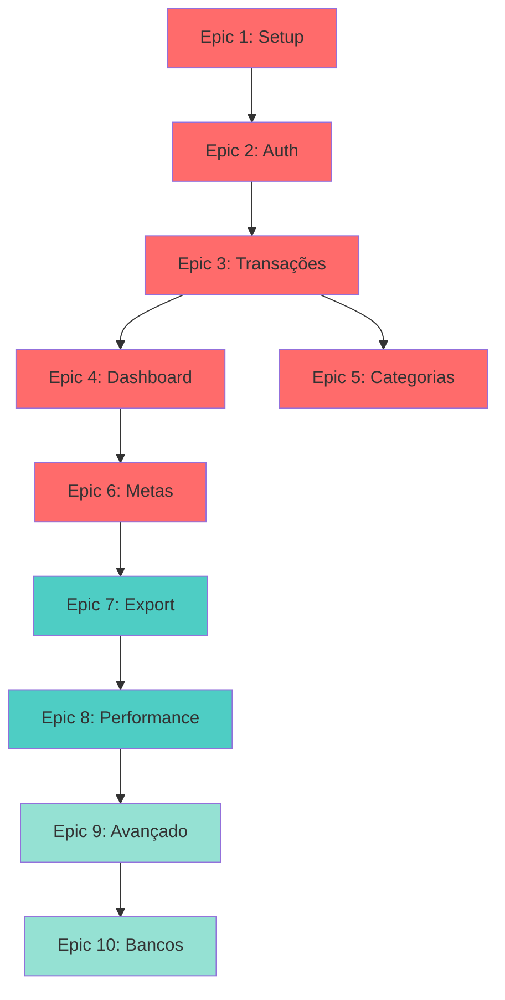

# User Stories - Dashboard de Finanças Pessoais

## Índice de Épicos

### ✅ Alta Prioridade (MVP)

1. **[Epic 1: Setup e Infraestrutura](./epic-1-setup-infrastructure.md)** ⚙️
   - Status: Not Started
   - Estimativa: 3-5 dias
   - 8 stories
   - Configuração completa do projeto

2. **[Epic 2: Autenticação e Gerenciamento de Usuários](./epic-2-authentication.md)** 🔐
   - Status: Not Started
   - Estimativa: 5-7 dias
   - Depende de: Epic 1
   - 9 stories
   - Sistema completo de auth

3. **[Epic 3: Gerenciamento de Transações](./epic-3-transactions.md)** 💰
   - Status: Not Started
   - Estimativa: 7-10 dias
   - Depende de: Epic 2
   - 10 stories
   - CRUD completo de transações

4. **[Epic 4: Dashboard e Visualizações](./epic-4-dashboard.md)** 📊
   - Status: Not Started
   - Estimativa: 5-7 dias
   - Depende de: Epic 3
   - Métricas e gráficos

5. **[Epic 5: Gerenciamento de Categorias](./epic-5-categories.md)** 🏷️
   - Status: Not Started
   - Estimativa: 3-4 dias
   - Depende de: Epic 3
   - Categorias customizadas

6. **[Epic 6: Metas Financeiras](./epic-6-goals.md)** 🎯
   - Status: Not Started
   - Estimativa: 5-7 dias
   - Depende de: Epic 4
   - Sistema de metas e alertas

### 🔵 Média Prioridade (Pós-MVP)

7. **[Epic 7: Exportação de Dados](./epic-7-export.md)** 📤
   - Status: Not Started
   - Estimativa: 3-4 dias
   - Export CSV/PDF

8. **[Epic 8: Otimizações e Performance](./epic-8-performance.md)** ⚡
   - Status: Not Started
   - Estimativa: 2-3 dias
   - Melhorias de performance

### 🟢 Baixa Prioridade (Futuro)

9. **[Epic 9: Recursos Avançados](./epic-9-advanced.md)** 🚀
   - Status: Not Started
   - Estimativa: 7-10 dias
   - Recorrência, tags, anexos

10. **[Epic 10: Integração com Bancos](./epic-10-bank-integration.md)** 🏦
    - Status: Not Started
    - Estimativa: 10-15 dias
    - Open Finance Brasil

---

## Progresso Geral

| Epic            | Status      | Progresso      | Estimativa     | Stories |
| --------------- | ----------- | -------------- | -------------- | ------- |
| 1. Setup        | Not Started | 0%             | 3-5 dias       | 8       |
| 2. Autenticação | Not Started | 0%             | 5-7 dias       | 9       |
| 3. Transações   | Not Started | 0%             | 7-10 dias      | 10      |
| 4. Dashboard    | Not Started | 0%             | 5-7 dias       | 7       |
| 5. Categorias   | Not Started | 0%             | 3-4 dias       | 5       |
| 6. Metas        | Not Started | 0%             | 5-7 dias       | 8       |
| 7. Exportação   | Not Started | 0%             | 3-4 dias       | 4       |
| 8. Performance  | Not Started | 0%             | 2-3 dias       | 6       |
| **MVP Total**   | **0%**      | **33-47 dias** | **57 stories** |

---

## Roadmap de Desenvolvimento

### Sprint 1 (Semana 1-2)

- ✅ Epic 1: Setup e Infraestrutura
- ✅ Epic 2: Autenticação (início)

### Sprint 2 (Semana 3-4)

- ✅ Epic 2: Autenticação (conclusão)
- ✅ Epic 3: Transações (início)

### Sprint 3 (Semana 5-6)

- ✅ Epic 3: Transações (conclusão)
- ✅ Epic 5: Categorias

### Sprint 4 (Semana 7-8)

- ✅ Epic 4: Dashboard e Visualizações
- ✅ Epic 6: Metas Financeiras (início)

### Sprint 5 (Semana 9-10)

- ✅ Epic 6: Metas Financeiras (conclusão)
- ✅ Epic 7: Exportação
- 🎉 **MVP Release**

### Sprint 6+ (Pós-MVP)

- Epic 8: Otimizações
- Epic 9: Recursos Avançados
- Epic 10: Integração Bancária

---

## Priorização por Valor

### Must Have (MVP)

1. Autenticação segura
2. CRUD de transações
3. Dashboard com métricas básicas
4. Categorias customizadas
5. Metas financeiras

### Should Have (v1.1)

6. Exportação de dados
7. Otimizações de performance
8. Filtros avançados

### Could Have (v1.2)

9. Transações recorrentes
10. Tags e etiquetas
11. Anexos de comprovantes

### Won't Have (v2.0+)

12. Integração bancária
13. Multi-currency
14. Relatórios avançados com BI
15. App mobile nativo

---

## Dependências entre Épicos



---

## Métricas de Sucesso

### Técnicas

- [ ] 100% dos testes E2E passando
- [ ] Coverage de testes > 80%
- [ ] Lighthouse Score > 90
- [ ] Tempo de carregamento < 3s
- [ ] Zero vulnerabilidades críticas

### Produto

- [ ] Onboarding completo < 2 minutos
- [ ] Tempo para primeira transação < 30 segundos
- [ ] Taxa de erro < 1%
- [ ] Mobile usability score > 95

### Negócio (pós-launch)

- [ ] 100 usuários ativos no primeiro mês
- [ ] Taxa de retenção > 60% (D7)
- [ ] NPS > 8

---

## Convenções e Padrões

### Nomenclatura de Branches

```
feature/epic-1-story-2-setup-tailwind
bugfix/fix-login-redirect
hotfix/security-patch
```

### Commits

```
feat(auth): implement login page
fix(transactions): correct amount calculation
docs(readme): update setup instructions
test(e2e): add transaction CRUD tests
```

### Pull Requests

- Título: `[Epic X.Y] Nome da Story`
- Descrição com link para story
- Checklist de DoD
- Screenshots se UI
- Review obrigatório

---

## Recursos e Referências

### Documentação

- [PRD](../prd.md)
- [Arquitetura](../architecture.md)
- [Tech Stack](../architecture.md#3-tech-stack)

### Design

- [Figma/Wireframes](#) (a criar)
- [Style Guide](#) (a criar)

### APIs Externas

- [Supabase Docs](https://supabase.com/docs)
- [NextAuth Docs](https://next-auth.js.org)
- [Prisma Docs](https://www.prisma.io/docs)

---

## Contatos

**Product Owner:** [Nome]  
**Tech Lead:** [Nome]  
**QA Lead:** [Nome]

---

**Última atualização:** 2025-10-29  
**Versão do documento:** 1.0
